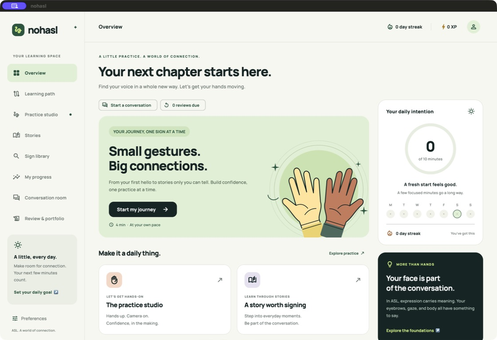

# nohasl

A thoughtfully designed Flutter studio for learning American Sign Language through lessons, stories, and hands-on practice. Web, macOS, and iOS are the initial focus; Android and Windows targets are also included.

## What is built

- **72 units and 576 learning activities** across six developmental stages. Each authored unit has communicative outcomes, vocabulary and concepts, grammar, culture, a receptive task, an expressive task, partner roles, a transfer scenario, prerequisites, references, and a three-part milestone rubric.
- Eight activity types per unit: observation, comprehension, grammar contrast, expressive rehearsal, retrieval, information-gap exchange, story transfer, and checkpoint. All 54 existing lesson IDs retain their original content and saved progress.
- **24 focused practice activities** with concept checks, camera rehearsal, spatial arrangement and narrative ordering interactions, and deliberate self-reflection.
- **18 conversation scenarios plus custom topics.** On eligible iOS 26/macOS 26 devices, Apple's Foundation Models framework supplies real on-device text conversations with follow-up questions and practice goals. Authored guided rehearsal works across platforms. The model cannot see signing or translate text into ASL.
- **Optional downloadable conversation models:** approximately 212 MB SmolLM2 or 1.49 GB Gemma 2 in WebGPU browsers; approximately 491 MB Qwen on native platforms. Review size, memory needs and license before downloading, then choose the model separately. Apple Intelligence remains the initial default when available. Cancel downloads or replies, switch providers, and remove model files in the conversation room. See [local model setup](docs/LOCAL_MODELS.md).
- Separate receptive and expressive **spaced-review queues**, personal practice focuses, self-rated recall, and a local reflection portfolio. Saved state migrates existing progress without resetting XP.
- User-initiated live camera preview on supported web, iOS, Android, and macOS configurations, with self-review, timing, camera switching, and unavailable/permission handling.
- A responsive dashboard, interactive stories, a searchable concept library drawn from the program, local progress, custom vector artwork, bundled typography, and branded platform icons.

This is a working learning application with a comprehensive **instructional blueprint**. The authored briefs and activities still need compensated Deaf educator review and authentic licensed signer media before they can constitute a complete language course. Missing reference media is surfaced in the lesson player, with links to learning resources. Concept questions and self-reflection do not assess actual ASL production. Completion and XP measure participation; neither the camera nor Apple Intelligence determines fluency. Live tutoring, validated sign feedback, and independent proficiency assessment remain production work.

## Run locally

The project and CI use **Flutter 3.38.10 / Dart 3.10.9**. The optional native model runtime sets the application minimums to **iOS 16.4 and macOS 14**. Apple Intelligence still requires an eligible device running iOS/macOS 26 with its model available. Apple builds require macOS, Xcode with the relevant platform support, and native plugin tooling. Run `flutter doctor -v` to inspect your environment.

```sh
flutter pub get
flutter run -d macos
```

For iOS Simulator, start a simulator, find its ID, and run the app:

```sh
open -a Simulator
flutter devices
flutter run -d <ios-simulator-device-id>
```

For web, the pinned browser runtime is already bundled. After changing its sources, regenerate and test it with Node 22:

```sh
npm --prefix scripts/local_models ci --ignore-scripts
npm --prefix scripts/local_models test
npm --prefix scripts/local_models run build
```

Run the web app:

```sh
flutter run -d chrome
```

Camera access on web requires a supported browser and a secure context such as HTTPS or localhost. On native platforms, grant camera access when starting practice. An iOS Simulator can exercise the application and its unavailable-camera state; a physical iPhone is needed to validate real iOS capture. Windows camera support is not yet implemented.

## Verify and build

```sh
dart format --output=none --set-exit-if-changed lib test integration_test
flutter analyze
flutter test
flutter test integration_test/app_test.dart -d macos
flutter test integration_test/app_test.dart -d <ios-simulator-device-id>
flutter test integration_test/apple_intelligence_native_test.dart -d macos
flutter test integration_test/apple_intelligence_native_test.dart -d <ios-simulator-device-id>
flutter build web --release --pwa-strategy=none
flutter build macos --debug --target lib/main.dart
flutter build ios --simulator --debug --no-codesign --target lib/main.dart
```

Rebuild with `lib/main.dart` after a native integration test before distributing the local app bundle: integration tests build an app with the test entrypoint. Build outputs are `build/web`, `build/macos/Build/Products/Debug/nohasl.app`, and `build/ios/iphonesimulator/Runner.app`. Simulator/debug apps are development artifacts, not signed store releases.

Local verification includes the complete unit/widget suite, native learning-flow integration on macOS and iPhone Simulator, and a web release build. The Apple Intelligence native test verifies channel registration and availability; when the local model is available it also generates a real structured response and cancels an in-flight request. Both Mac and this iOS Simulator successfully generated responses. See the [validation report](docs/VALIDATION.md) for exact results and limits.

[GitHub Actions](.github/workflows/ci.yml) checks formatting, analysis, tests, and web output. Apple CI builds macOS, runs both native suites, rebuilds the normal app entrypoint, and builds iOS Simulator. Android and Windows jobs produce debug artifacts. The foundation PR has successfully built all five targets; the expanded branch is separately validated by its PR checks. CI does not validate camera hardware or guarantee that Apple Intelligence is available on the runner.

## Product and engineering notes

- [Product plan](docs/PRODUCT_PLAN.md): implemented program, production roadmap, media workflow, assessment, accessibility, and release gates.
- [Architecture](docs/ARCHITECTURE.md): implemented foundation, proposed content/data contracts, platform adapters, camera lifecycle, recognition interfaces, privacy, and testing strategy.
- [Validation report](docs/VALIDATION.md): exact checks, tested platforms, screenshots and remaining device QA.
- [Camera implementation](docs/CAMERA.md): supported providers, permissions, self-review and lifecycle.
- [Curriculum](docs/CURRICULUM.md): sequence, editorial status, sources, and Deaf-led review requirements.
- [Full program map](docs/PROGRAM_MAP.md): all 72 detailed unit briefs, outcomes, practice tasks, partner roles, misconceptions, and rubrics.
- [Learning system](docs/LEARNING_SYSTEM.md): review scheduling, self-report evidence, migration, and persistence.
- [Optional local models](docs/LOCAL_MODELS.md): provider selection, explicit downloads, browser and native runtimes, cache behavior, and limitations.
- [Apple Intelligence](docs/APPLE_INTELLIGENCE.md): native architecture, availability, privacy, safeguards, and real-model tests.

The six internal stages are learning bands, not ASLPI or SLPI ratings. Advanced transfer requires unfamiliar signers, spontaneous partner responses, delayed retrieval, varied language models, and qualified human feedback. The program map makes those requirements concrete; checking off 576 activities cannot establish proficiency by itself.

## Regenerate app icons

The monogram is drawn from vector paths by a small macOS Swift script. It generates every existing iOS/macOS app icon size, Android launcher PNGs, web icons/favicon, and a multi-resolution Windows ICO without third-party image dependencies:

```sh
swift tools/generate_icons.swift
```

The iOS app icons are opaque so the platform can apply its own mask; desktop/Android icons use rounded ink tiles, and web maskable icons keep the mark inside a safe central area.

## Preview



[Web screenshot](docs/screenshots/web.png) · [iPhone simulator screenshot](docs/screenshots/ios.png)
